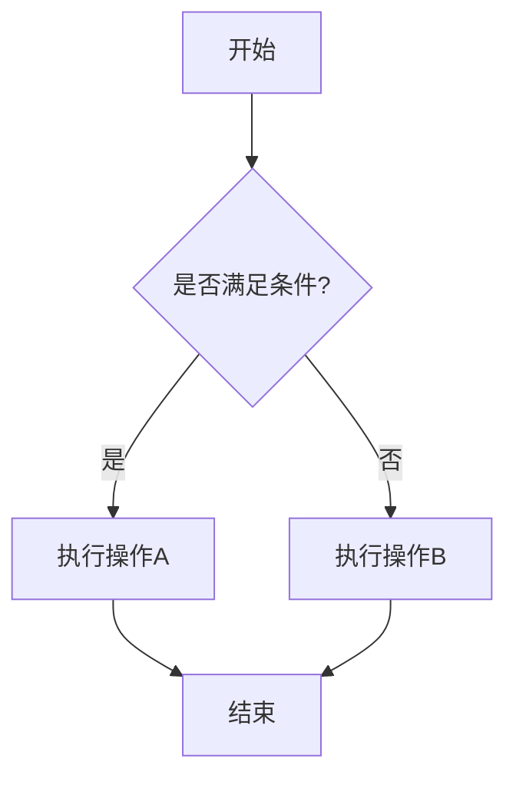

# Markdown 增强功能演示

这篇文章将展示我们博客中支持的各种 Markdown 增强功能。

## 基础语法

### 文本样式

**粗体文本** 和 *斜体文本* 以及 ~~删除线~~

### 列表

- 无序列表项 1
- 无序列表项 2
  - 嵌套项 1
  - 嵌套项 2

1. 有序列表项 1
2. 有序列表项 2
3. 有序列表项 3

### 任务列表

- [x] 已完成的任务
- [ ] 未完成的任务
- [ ] 另一个未完成的任务

## 代码块

### JavaScript 代码

```javascript
// 这是一个 JavaScript 代码示例
function fibonacci(n) {
  if (n <= 1) return n;
  return fibonacci(n - 1) + fibonacci(n - 2);
}

console.log(fibonacci(10)); // 输出: 55
```

### Python 代码

```python
# 这是一个 Python 代码示例
def quick_sort(arr):
    if len(arr) <= 1:
        return arr
    pivot = arr[len(arr) // 2]
    left = [x for x in arr if x < pivot]
    middle = [x for x in arr if x == pivot]
    right = [x for x in arr if x > pivot]
    return quick_sort(left) + middle + quick_sort(right)

print(quick_sort([3, 6, 8, 10, 1, 2, 1]))
```

## 数学公式

### 行内公式

这是一个行内公式：$E = mc^2$

### 块级公式

$$
\frac{d}{dx}\left( \int_{0}^{x} f(u)\,du\right)=f(x)
$$

$$
\sum_{i=1}^{n} i = \frac{n(n+1)}{2}
$$

## 流程图



## 图标

使用内置图标语法：

- ::icon-home:: 首页
- ::icon-user:: 用户
- ::icon-settings:: 设置
- ::icon-heart:: 喜欢
- ::icon-star:: 收藏

## 提示容器

::: tip 提示
这是一个提示信息，用于显示有用的建议。
:::

::: warning 警告
这是一个警告信息，用于提醒用户注意某些事项。
:::

::: danger 危险
这是一个危险信息，用于警告用户可能的风险。
:::

::: info 信息
这是一个普通信息提示。
:::

::: details 点击查看详情
这里是详细内容，默认是折叠的，点击标题可以展开查看。

你可以在这里放置任何内容：

- 列表项
- **粗体文本**
- `代码`

```javascript
console.log('Hello World!');
```
:::

## 表格

| 功能 | 支持 | 说明 |
|------|------|------|
| 数学公式 | ✅ | 支持 KaTeX |
| 流程图 | ✅ | 支持 Mermaid |
| 图标 | ✅ | 支持 Iconify |
| 代码高亮 | ✅ | 支持多种语言 |
| 图片懒加载 | ✅ | 提升页面性能 |

## 引用

> 这是一个引用块。
> 
> 可以包含多行内容。
> 
> > 这是嵌套引用。

## 链接和图片

[这是一个链接](https://github.com/icxcc/icxcc.github.io)


## 缩写

*[HTML]: HyperText Markup Language
*[CSS]: Cascading Style Sheets
*[JS]: JavaScript

HTML 和 CSS 是前端开发的基础，JS 用于添加交互功能。

## 注释

这里有一个注释[^1]，还有另一个注释[^2]。

[^1]: 这是第一个注释的内容。
[^2]: 这是第二个注释的内容，可以包含更多信息。

## 总结

这篇文章展示了我们博客支持的各种 Markdown 增强功能。这些功能让我们能够创建更加丰富和专业的技术文档和博客文章。

希望这些功能能够帮助你创建更好的内容！